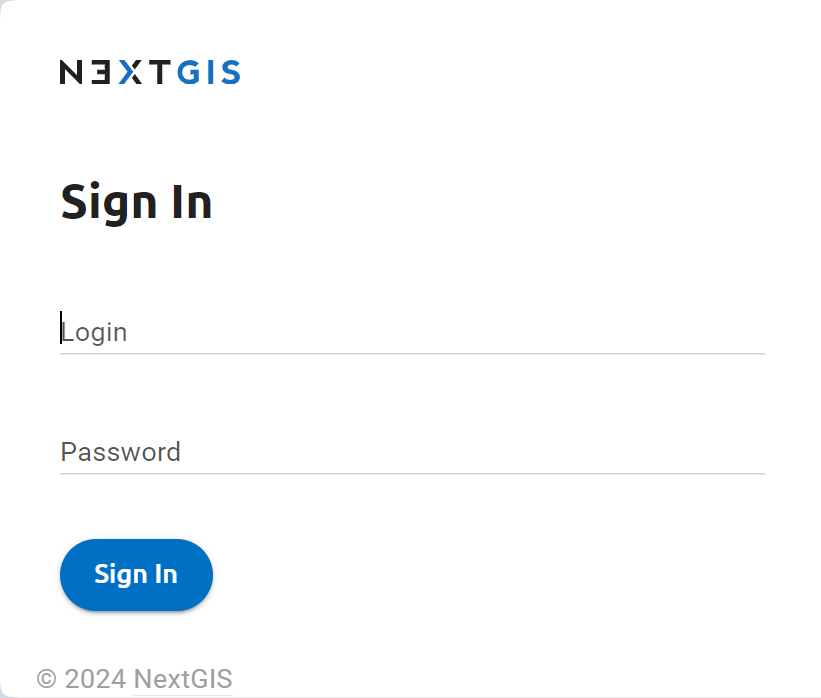
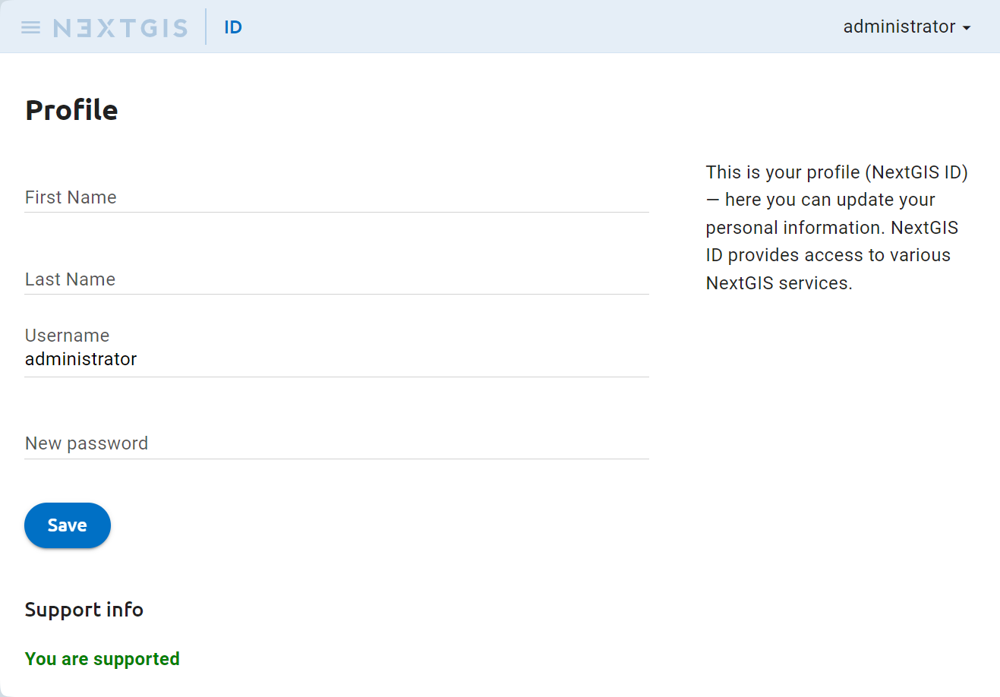
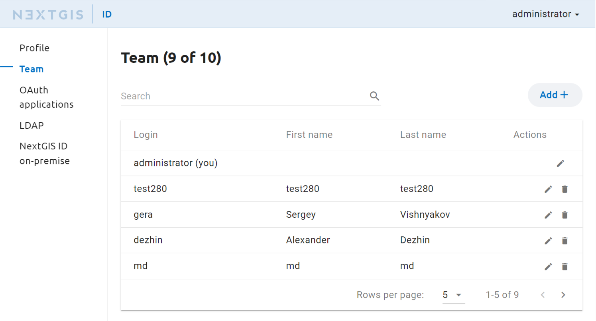
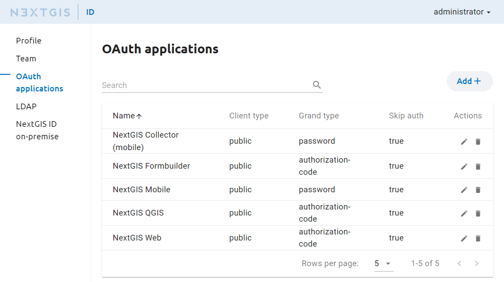
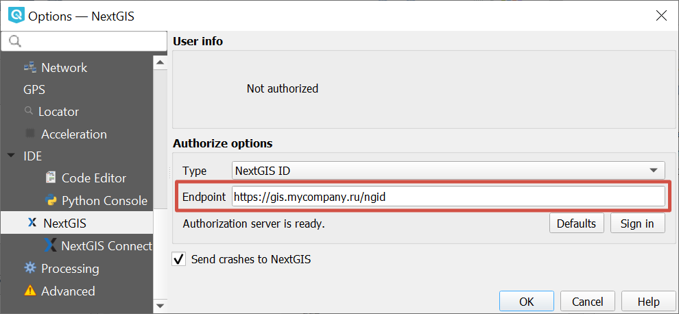
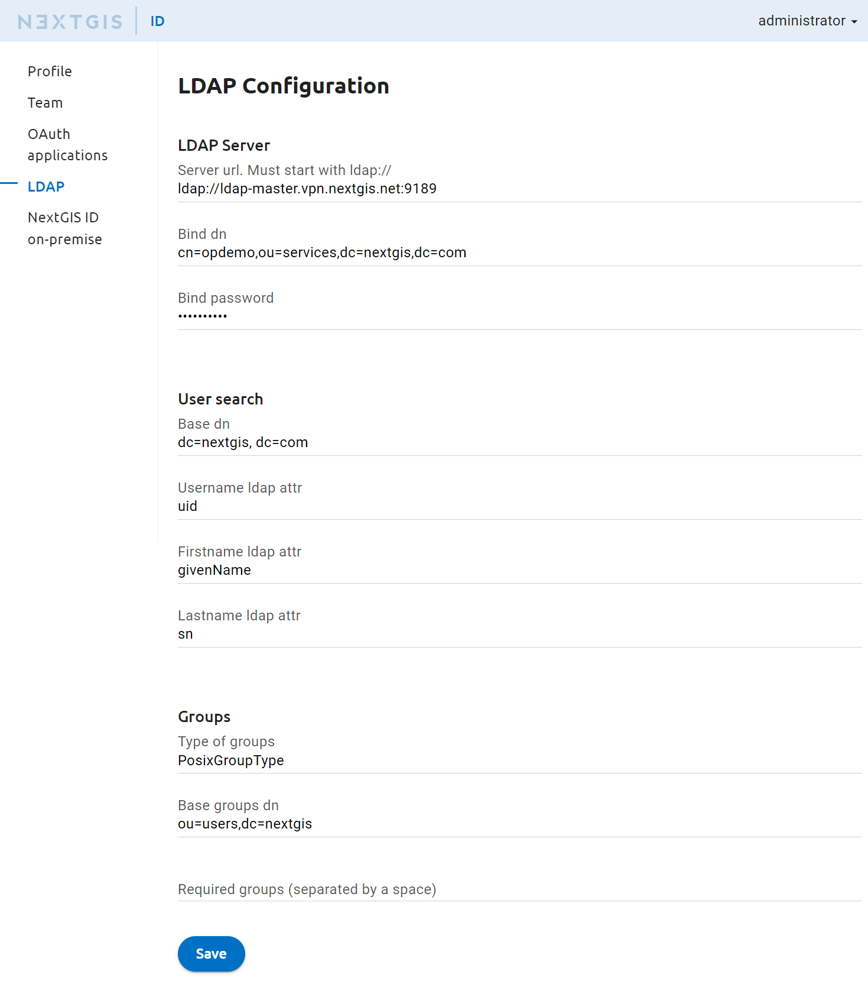
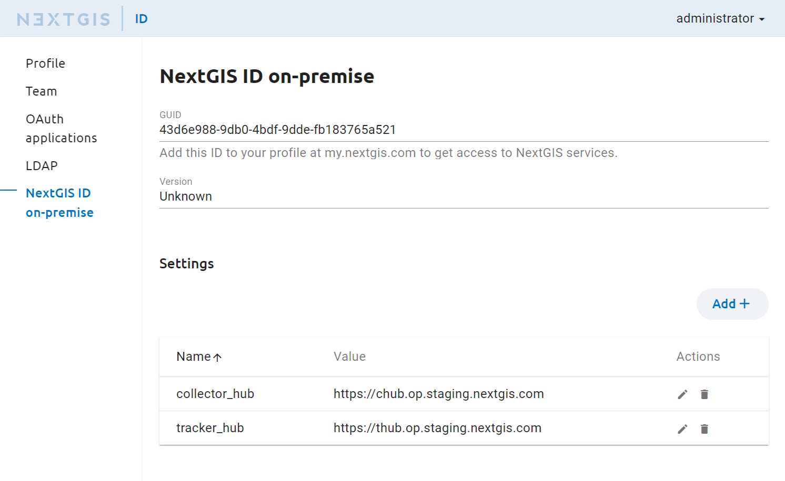
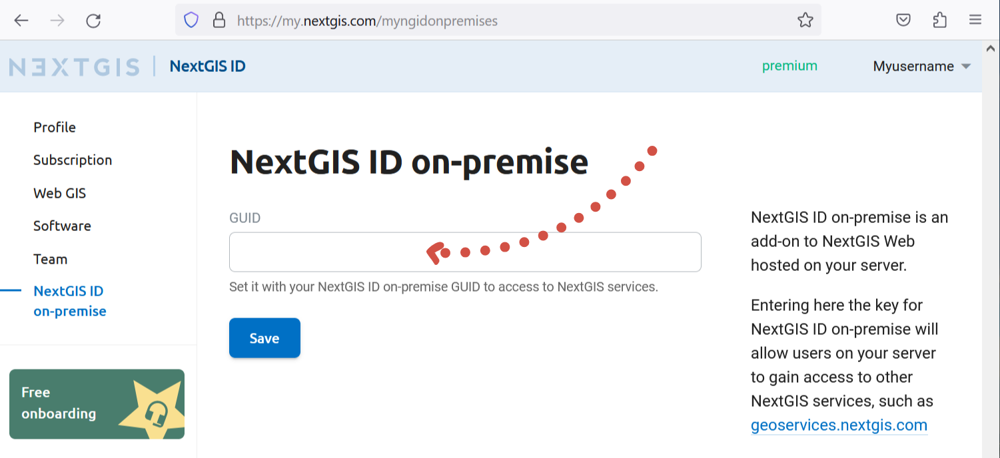

.. _ngidop:

Overview
==============

NextGIS ID on-premise (NGID on-premise) is an authorization and user management server for NextGIS software. 
For companies with local networks isolated from the Internet to a certain degree this offers a way to authorize users of desktop and mobile 
NextGIS software.

The functionality of NGID on-premise includes:

* user sign-in with login and password;
* modifying user credentials (login, password), deleting users;
* adding users to a team that has extended access to software features, managing team members;
* user sign-in via OAuth2 in various applications;
* personal web pages for users where they can view their profile and change their password.

.. _ngidop_auth:

Authorization and profile
--------------

The home page of NGID on-premise opens on a sign-in dialog (see :numref:`auth_window`). Enter login and password for a user created in the Admin Console.

   User authorization window

After a successful sign-in you'll see the user profile page (see :numref:`profile_window`). 
On this page the user can modify personal information and change password.

   User profile window

.. _ngidop_teams:

Team
--------

To add a new team member, enter login and password for the user. You can also delete a user from the team. Team management is available in the **Team** section, add **/users** to the URL to view it (see :numref:`ngidop_team`). Each added user is displayed in the list. Users included in the team have access to extended functionality of the NextGIS software.

   Adding users to the Team

.. _ngidop_app_oauth:

OAuth applications
-----------------------

You can permit this type of authorization for various NextGIS apps. Set it up in the *OAuth Application* section of the settings (see :numref:`ngidop_apps_oauth`):

* `NextGIS QGIS <https://docs.nextgis.com/docs_ngqgis/source/auth.html#ngidop>`_
* `NextGIS Formbuilder <https://docs.nextgis.com/docs_formbuilder/source/gui.html#ngidop>`_
* `NextGIS Mobile <https://docs.nextgis.com/docs_ngmobile/source/auth.html#ngidop>`_
* `NextGIS Collector <https://docs.nextgis.com/docs_collector/source/auth.html#ngidop>`_

Each of this apps must be configured to allow authorization via NextGIS ID on-premise. By default the apps use the cloud authorization service my.nextgis.com. For more details on setting up authorization in these apps see the corresponding documentation.

   
   Setting up OAuth applications
 
 
.. note::
   To access the extended functionality of the desktop and mobile software you need to enter the NextGIS ID server in the settings of the desktop application (see :numref:`auth_server_settings`). By default it uses the public authorization service `https://my.nextgis.com <https://my.nextgis.com>`_.

For a service deployed in a local network the address follows the model of `https://gis.mycompany.com/ngid <https://gis.mycompany.com/ngid>`_. 
Enter this URL as the authorization server address. In a web browser use the link:
* https://gis.mycompany.com/ngid/ - user profile will open.
   

   Configuring authorization server in QGIS

   

.. _ngidop_ldap:

Setting up LDAP
--------------

To open LDAP settings, add **/ldapsettings** to the URL (see :numref:`ldap_settings`).
In the LDAP SERVER section enter the URL of the authorization server, user login and password to sign in on the server.

**Integration with Microsoft Active Directory external server** 

During sign-in via the standard dialog in NextGIS Web the system checks if the user exists in the NextGIS Web software. If it is a Microsoft Active Directory account, the password is checked in the Microsoft Active Directory. If the user does not exist in NextGIS Web, the Microsoft Active Directory database is checked for the username. If the user is found in that database, the password is checked. If the Microsoft Active Directory signs in the user successfully, NextGIS Web will automatically create a user with the same login. The account type will be set to Microsoft Active Directory.

   LDAP settings page
   
In the **User search** section enter the data base to be used for user search and LDAP attributes for the search parameters (login, name, surname).

If a user is part of a **group**, you can add that information in the last section of the LDAP configuration section. This field is not required, but it allows to limit access for users outside a particular group. Users that are members of other groups won't be able to sign in even if they enter a correct login/password combination.

.. _ngidop_guids:

NextGIS ID on-premise identificator
-----------------------------------
For integration with global NextGIS services (such as `geoservices <https://geoservices.nextgis.com/>`_) a unique GUID is used. You can view it in the **NextGIS ID on-premise** section (see :numref:`ngidop_guid`). To set it up open your profile on `my.nextgis.com <https://my.nextgis.com/myngidonpremises>`_ and enter the GUID in the NextGIS ID on-premise section (see :numref:`GUID_on_my`).

   GUID in NextGIS ID on-premise settings

   GUID in the NextGIS ID cloud account
   
For Collector and Tracker enter the hub parameters to the table in **Settings** using the addresses where they are deployed.
