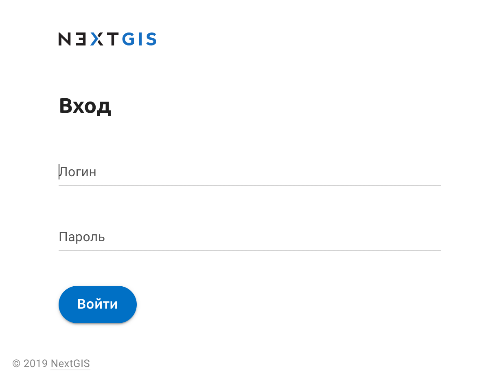
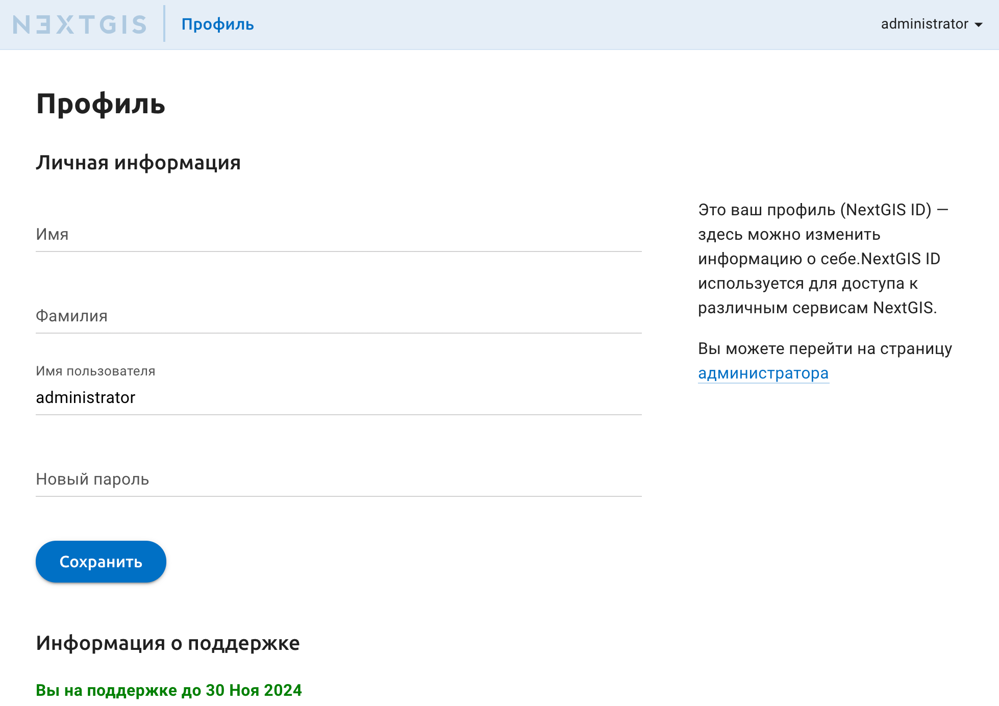
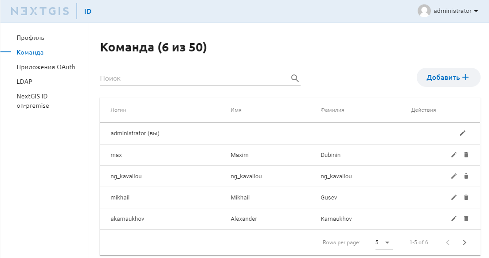
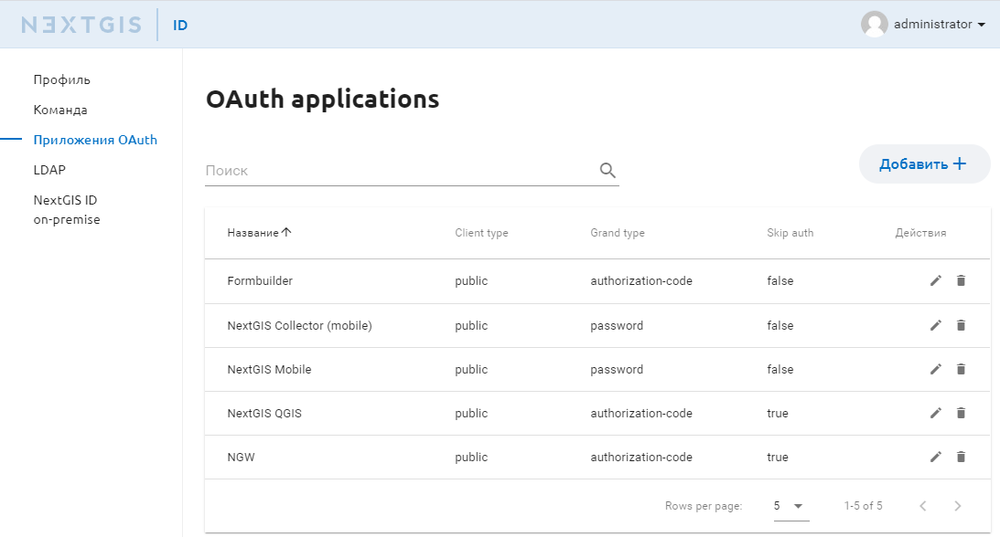
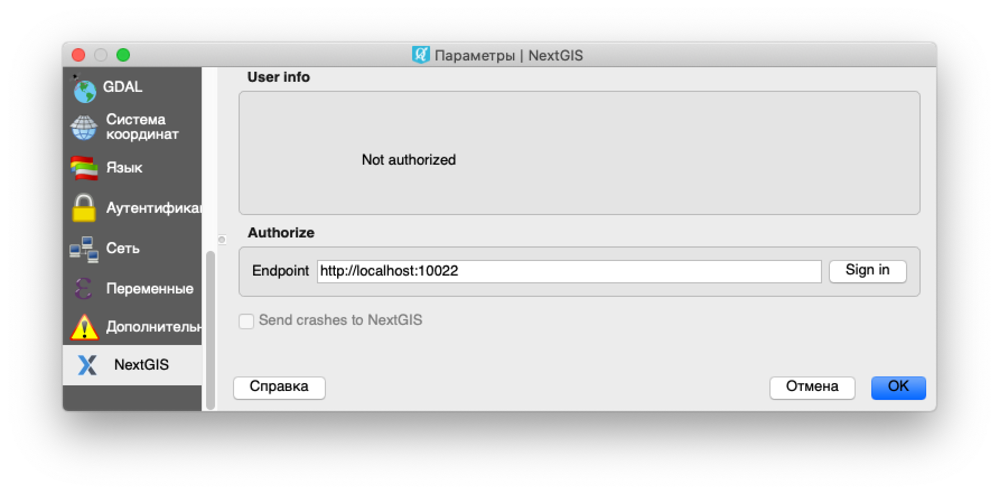
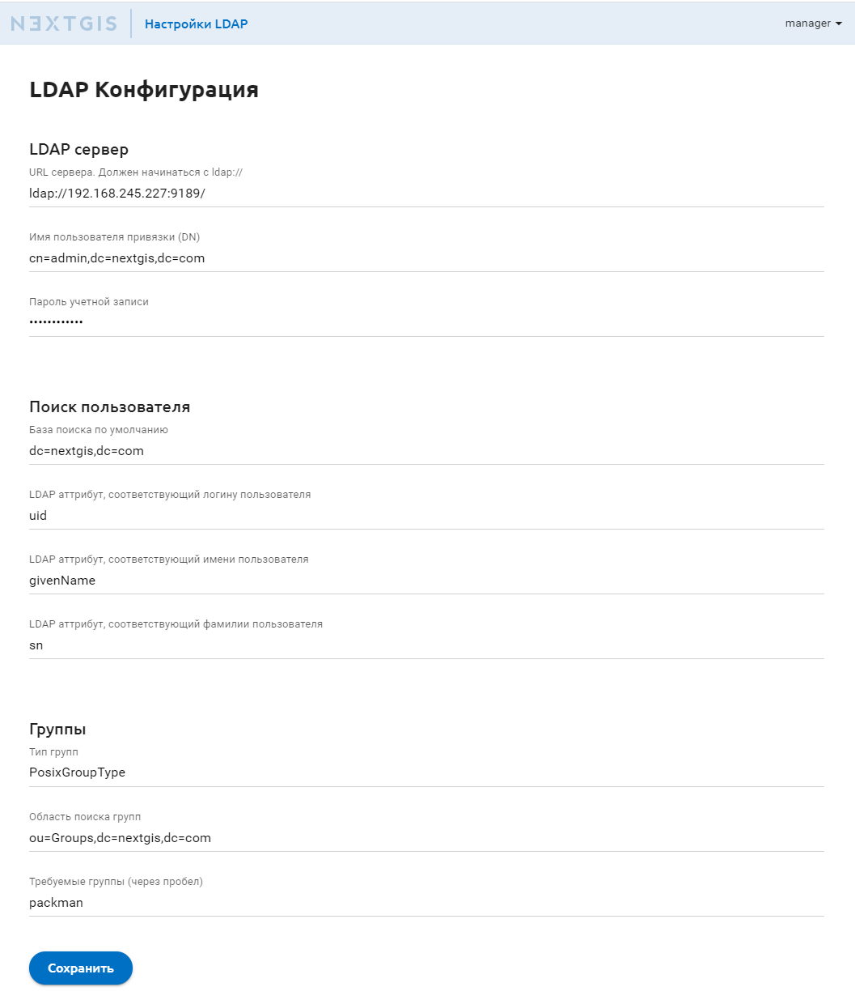
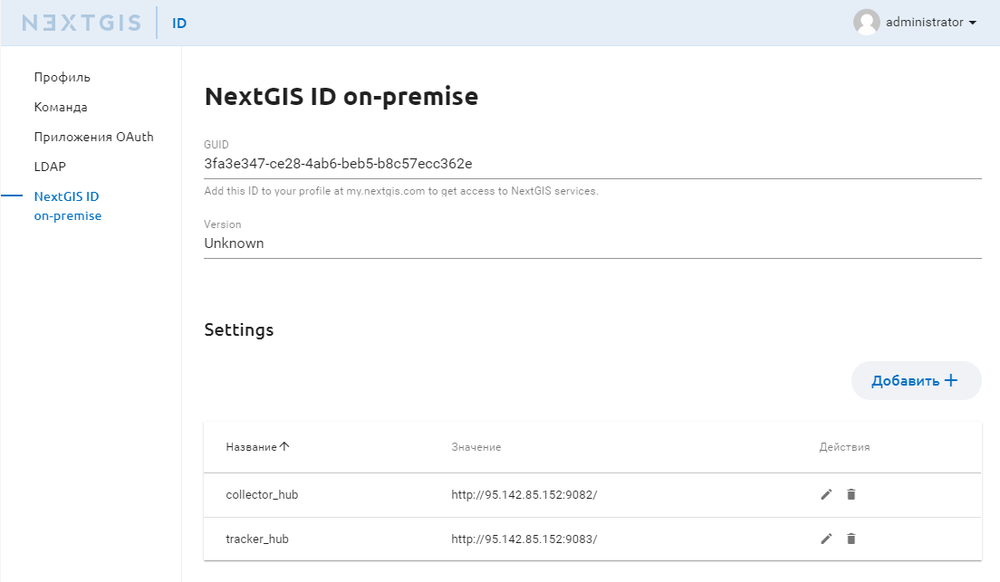
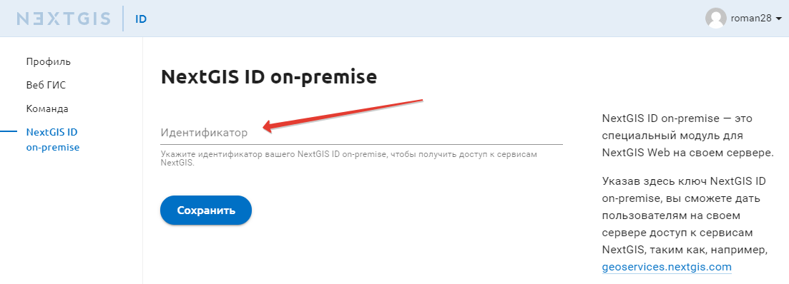

.. sectionauthor:: Роман Гайнуллов <roman.gainullov@nextgis.com>

.. _ngidop:

Общее описание
==============

NextGIS ID on-premise (NGID on-premise) - это сервер авторизации и управления пользователями программного обеспечения NextGIS. 
В локальных сетях организаций с определенным уровнем изоляции от глобальной сети интернет, требуются функции авторизации пользователей настольного 
и мобильного программного обеспечения (ПО) NextGIS.

NGID on-premise предоставляет следующие возможности:

* вход пользователей с указанием логина и пароля;
* изменение свойств пользователей (имя, пароль), удаление пользователей;
* добавление пользователей в команду, которой обеспечивается расширенный доступ к функциональности ПО, изменение состава команды;
* авторизация пользователей через OAuth2 в различных приложениях;
* персональная веб страница пользователя с профилем пользователя и возможность изменить пароль входа.

.. _ngidop_auth:

Вход и профиль
--------------

При переходе на главную страницу NGID on-premise открывается диалог входа пользователя (см. :numref:`auth_window`), в котором необходимо указать логин и пароль пользователя, заведенного в административном интерфейсе.

   Окно авторизации пользователя

После успешной авторизации, пользователю отображается окно со страницей его профиля (см. :numref:`profile_window`). 
В данном окне пользователь может изменить информацию о себе и пароль учетной записи.

   Окно профиля пользователя

.. _ngidop_teams:

Команда
--------

Механизм управления командой позволяет добавить в свою команду дополнительного пользователя, указав для него логин и пароль, или удалить его из команды. Управление командой доступно через личный кабинет по подпути **/users** в разделе “Команда” (см. :numref:`ngidop_team`). Каждый добавленный пользователь появится в списке и будет иметь расширенный доступ к функиям ПО NextGIS.

   Добавление пользователей в Команду

.. _ngidop_app_oauth:

Приложения OAuth
-----------------------

В разделе *Приложения OAuth* предоставляется доступ для авторизации в различных приложениях NextGIS (см. :numref:`ngidop_apps_oauth`):

* `NextGIS QGIS <https://docs.nextgis.ru/docs_ngqgis/source/auth.html#ngidop>`_
* `NextGIS Formbuilder <https://docs.nextgis.ru/docs_formbuilder/source/gui.html#ngidop>`_
* `NextGIS Mobile <https://docs.nextgis.ru/docs_ngmobile/source/auth.html#ngidop>`_
* `NextGIS Collector <https://docs.nextgis.ru/docs_collector/source/auth.html#ngidop>`_

Каждое из этих приложений можно быть настроено для авторизации через NextGIS ID on-premise. По умолчанию эти приложения авторизуются через my.nextgis.com - облачный сервис. Подробности о том, как настроить авторизацию в этих приложениях см. в их документации.

   
   Настройка OAuth applications
 

.. csv-table:: Параметры конфигурации приложений OAuth
  :header: "app", "client_id", "secret", "redirects", "options"
  :widths: 30, 30, 50, 30, 50

  "NextGIS QGIS", tv88lHLi6I9vUIck7eHxhkoJRfSLR74eLRx4YrpN, "fjoRB04xVrhyGZ2W3wAmoNl9xntnzGYQdPOx9woYd7ByWi40jGvWS3kGMcZMe4XmExggmDA6AI4PLQQ9nOH5nlMJoBORZFZsJnHf1n4UlsyBni7x7ESC8kkIaBUktmRm", "http://localhost:65020, http://127.0.0.1:65020", "Client type: Public, \ Grant type: Authorization code"
  "NextGIS Formbuilder", 40ONLYJYYQFLBD6btOpQnJNO9DHfuejUt4FPSUJ3, "NBLCqBaQEhXtr4NAM8IgD6Jntte66FIRzk4nE6W71DlzYPdcfUyu7Oc51hDGVMxyDo4UrpHDxqX94qKt9UQa0VfcRrJWffD8MRAvTJfyaaiqbQ02N7EzINkz6Kob6EoK", "http://localhost:65020, http://127.0.0.1:65020", "Client type: Public, \ Grant type: Authorization code"
  "NextGIS Collector (mobile)", K4lDqemXBGQmYO4bFWRswpvDd1FKDjuenzsI7qOe, "ZHYKN1UMcfar0wbrQtbQ5KUgjjxucRKvcXYH65cqGI9YBAqo1ef34LoEpgg76jGO3Eg0CRRmehUAHZf7asexCBqREe5gR8z0SdCJSzpZ2bOPhIgwPTkeU7qbtixJK8UY", "", "Client type: Public, \ Grant type: Resource owner password-based"
  "NextGIS Mobile", "Im6GFdPPuPM09BnvFb3EacFZyq8TpRBSAAex7JDZ", "ymFxZ9Qx3A8HACtBjUk35Ah0riraJlgVzOUPm91RUvWZmAhM97hD3GjgW787PXR1iTGxWawVP9dFSJgGwaCkKNBIygUcYh4d2OVt3nHPtnHTujYfUbaanL5LIXycMB6M", " ", "Client type: Public, \ Grant type: Resource owner password-based"
  "NextGIS Web (on-premise)", "8P5WqTaVrvflO34dIuOg5bNz6TZDIvM08mBTrbJm", "iIpkKTsplLYKp3ww1F2VqgWq3sIlzJl66k1qWeL9eNymc8ixYYroPu9S2Ilj0GIiZpgX0IqacxS56fp97GodUptTZbQvrqxqpoYEXjjSRTwrvObnLPZ1A87zrs4qSxns", "устанавливается корректный у клиента", "Client type: Public, \  Grant type: Authorization code"

**Параметры конфигурации приложений OAuth**  
 
.. note::
   Для получения доступа к расширенным функциям настольного и мобильного ПО необходимо указать адрес сервера NextGIS ID в настройках настольного ПО (см. :numref:`auth_server_settings`). По-умолчанию используется публичный сервис авторизации `https://my.nextgis.com <https://my.nextgis.com>`_.

Во внутренней сети сервис может быть развернут по следующему адресу - `https://gis.mycompany.ru/ngid <https://gis.mycompany.ru/ngid>`_. 
Данный путь следует указывать в качестве адреса сервера авторизации. В браузере открывать следующий адрес:
* https://gis.mycompany.ru/ngid/ - профиль пользователя.
   

   Настройка сервера авторизации в NextGIS QGIS
   

.. _ngidop_ldap:

Настройка LDAP
--------------

Страница настроек LDAP открывается по подпути **/ldapsettings** (см. :numref:`ldap_settings`).
В блоке LDAP SERVER указывается адрес сервера авторизации, логин/пароль учетной записи пользователя для подключения к серверу.

**Интеграция с внешним сервером Microsoft Active Directory** 

При авторизации через стандартный диалог входа NextGIS Web идет проверка существования данного пользователя в ПО NextGIS Web. Если аккаунт пользователя имеет тип Microsoft Active Directory, то проверка пароля осуществляется в Microsoft Active Directory. Если пользователя не существует, то проверяется существование пользователя в сервере Microsoft Active Directory. Если пользователь существует, то проверяется введенный пароль. Если сервер Microsoft Active Directory успешно авторизовал пользователя, то в ПО NextGIS Web создается пользователь с такими же логином и именем и типом аккаунта Microsoft Active Directory.

   Страница настроек LDAP
   
В блоке **Поиск пользователя** указывается база, в которой осуществляется поиск пользователя и его LDAP атрибуты, соответствующие искомым параметрам (логин, имя, фамилия).

Если пользователь принадлежит какой-то **группе**, то имеется возможность указать это в последнем блоке настроек конфигурации LDAP. Параметр не является обязательным, но дает возможность ограничивать авторизацию пользователей, не принадлежащих к конкретной группе. Пользователи из других групп не будут иметь возможности авторизоваться даже при указании корректной пары логин/пароль.

.. _ngidop_guids:

Идентификатор NextGIS ID on-premise
-----------------------------------

.. note:: 
   Необходимо, чтобы на рабочих местах, где установлен NextGIS QGIS с модулем `Rosreestr Tools <https://docs.nextgis.ru/docs_ngqgis/source/NGQ_Rosreestr_Tools.html>`_
   открывался адрес с доменным именем geoservices.nextgis.com.
   Дополнительно вы также можете прописать разрешение на доступ к этому серверу (geoservices.nextgis.com) на сервере, где развернут NextGIS Web.

Для интеграции с глобальными сервисами NextGIS (такими как `geoservices <https://geoservices.nextgis.com/>`_, `NGQ Rosreestr Tools <https://docs.nextgis.ru/docs_ngqgis/source/NGQ_Rosreestr_Tools.html?highlight=ngq>`_) используется уникальный GUID, указанный в разделе **NextGIS ID on-premise** (см. :numref:`ngidop_guid`). Его необходимо прописать в настройках учетной записи на  `my.nextgis.com <https://my.nextgis.com/myngidonpremises>`_ в разделе NextGIS ID on-premise (см. :numref:`GUID_on_my`).

   Идентификатор GUID в разделе NextGIS ID on-premise

   Идентификатор GUID в облачном аккаунте NextGIS ID
   
В таблицу секции **Settings** необходимо внести настройки Коллектор и Трекер хабов в соответствии с адресами, на которых они развернуты.
