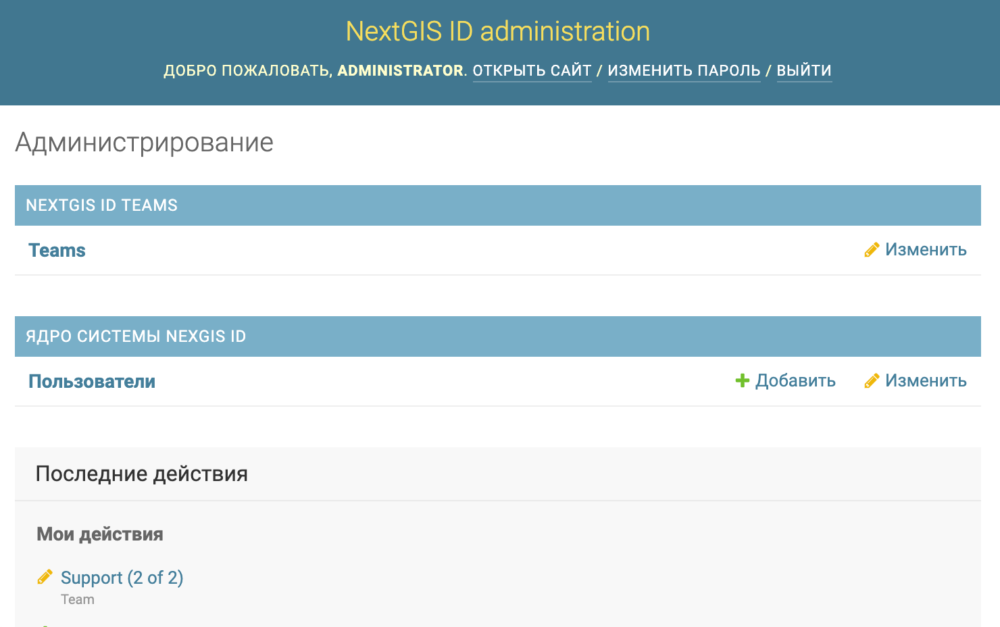

.. sectionauthor:: Роман Гайнуллов <roman.gainullov@nextgis.com>

.. _ngidop:

Общее описание NextGIS ID on-premise
========

В локальных сетях организаций с определенным уровнем изоляции от глобальной сети интернет, требуются функции авторизации пользователей настольного 
и мобильного программного обеспечения (ПО) NextGIS. Для этого необходимо использовать сервер авторизации NextGIS ID on-premise. 
Данный сервер предоставляет следующие возможности:

* ввод пользователя с указанием логина и пароля;
* изменение свойств пользователя (пароль, имя), удаление пользователя;
* добавление пользователя в группу, которой обеспечивается полный доступ ко всей функциональности ПО, изменение состава группы;
* веб интерфейс для авторизации пользователя в рамках oAuth2;
* персональная веб страница пользователя с профилем пользователя и возможность изменить пароль входа.

Административный интерфейс открывается по подпути **/admin** (см. :numref:`admin_interf`): 

   Административный интерфейс
   
В административном интерфейсе имеется два блока: пользователи и команды (группы).
В блоке пользователей администратор может добавить, изменить или удалить пользователей.
В блоке команд администратор может добавить или удалить пользователей из команды Support. Пользователи в команде Support будут иметь доступ ко всем функциям ПО NextGIS. 

При входе в корень сервиса / открывается диалог авторизации пользователя (см. :numref:`auth_window`) в котором необходимо указать логин и пароль пользователя, заведенного в административном интерфейсе.

.. figure:: _static/auth_window.png
   :name: auth_window
   :align: center
   :width: 16cm

   Окно авторизации пользователя
   
После успешной авторизации, пользователю отображается окно со страницей его профиля (см. :numref:`profile_window`). 
В данном окне пользователь может изменить информацию о себе и пароль входа.
Для получения доступа ко всем функциям настольного ПО NextGIS необходимо указать адрес сервера NextGIS ID в настройках настольного ПО (см. :numref:`auth_server_settings`). 
По-умолчанию выставлен публичный сервис авторизации `https://my.nextgis.com <https://my.nextgis.com>`_.

**Примечание:** во внутренней сети сервис может быть развернут по следующему адресу - `https://gis.mycompany.ru/ngid <https://gis.mycompany.ru/ngid>`_. 
Данный путь следует указывать в качестве адреса сервера авторизации. В браузере открывать следующие адреса:

* https://gis.mycompany.ru/ngid/admin - админстративный интерфейс;
* https://gis.mycompany.ru/ngid/ - профиль пользователя.

.. figure:: _static/profile_window.png
   :name: profile_window
   :align: center
   :width: 16cm

   Окно профиля пользователя
   
.. figure:: _static/auth_server_settings.png
   :name: auth_server_settings
   :align: center
   :width: 16cm

   Настройка сервера авторизации в NextGIS QGIS
  
